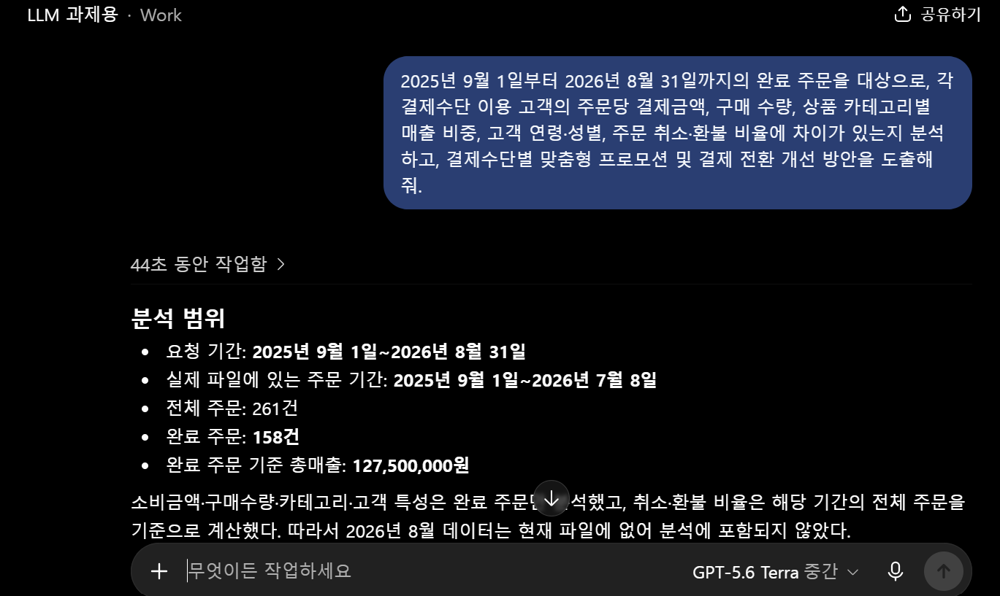
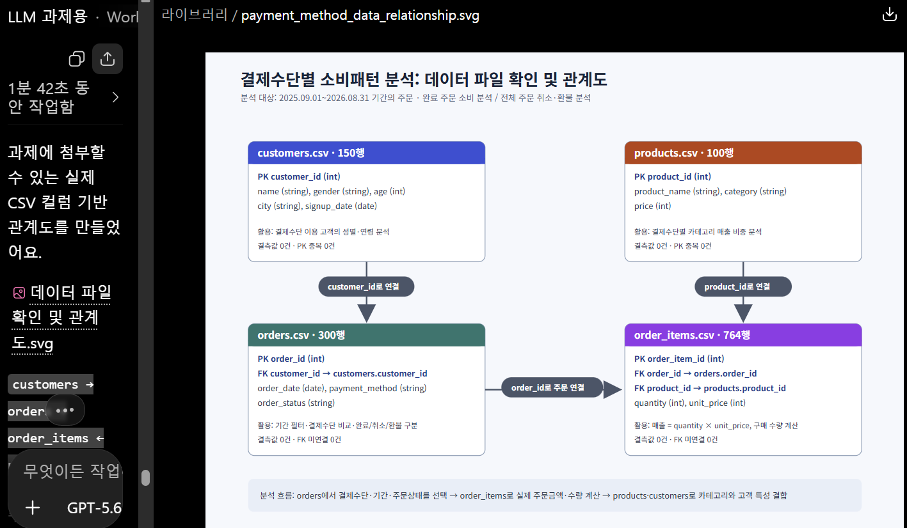
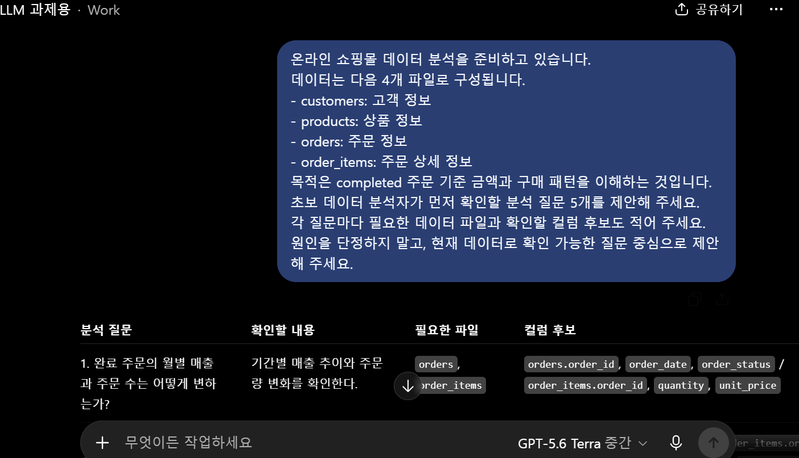
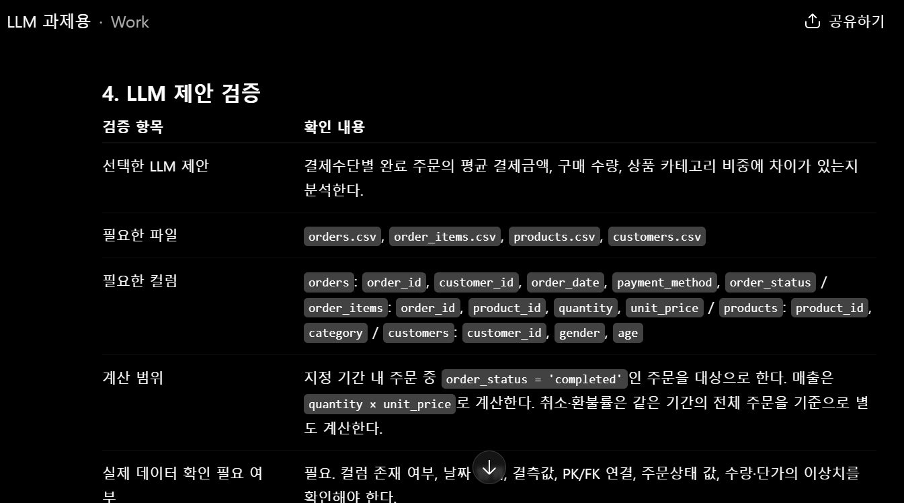
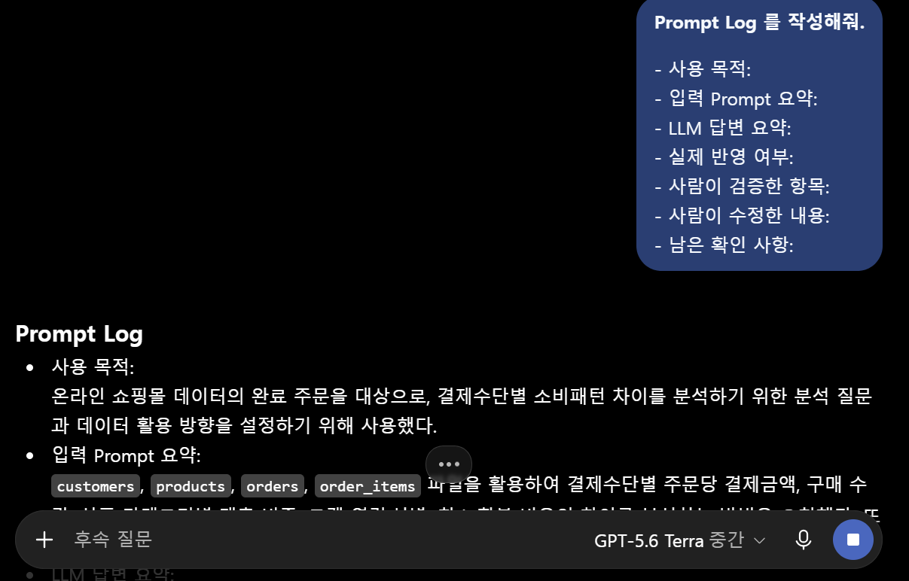
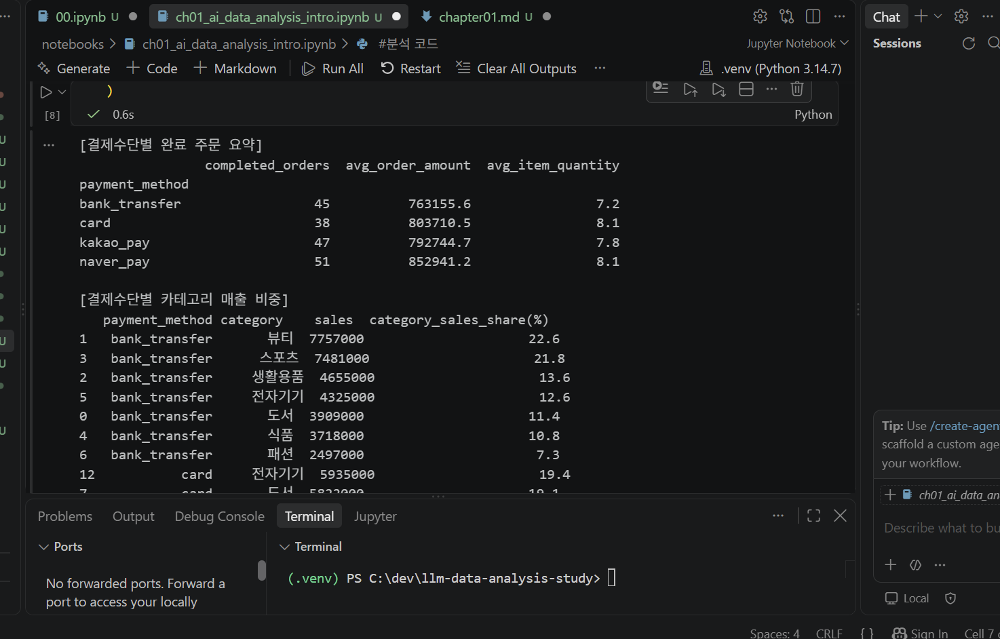

# Chapter 01 제출 답안. AI와 함께하는 데이터 분석의 시작
---

## 0. 제출 정보

- 이름: 우다현
- GitHub ID: woodahyun
- 개인 저장소명: `llm-data-analysis-study`
- 작성일: 2026-09-11
- 사용한 LLM: chatgpt

### 최종 제출 URL

https://github.com/woodahyun/llm-data-analysis-study/blob/main/chapter01/chapter01.md

---

## 1. 원래 업무 질문

### 내가 선택한 막연한 질문

결제 수단에 따른 소비패턴 차이를 분석해줘.

### 왜 이 질문이 모호하다고 생각했는가?

- 대상: 무엇을 분석할 것인가?
  > 모든 주문을 볼지, 실제 구매가 완료된 주문만 볼지 불분명하다. 또한 소비패턴이 결제금액, 구매 수량, 상품 카테고리, 고객 특성 중 무엇을 의미하는지도 정해지지 않았다.
- 기간: 
  > 어느 기간의 주문을 분석할지 정해지지 않았다.
- 기준: 어떤 단위로 볼 것인가?
  > 주문 1건, 고객 1명, 상품 1개 중 어떤 단위로 소비를 측정할지 정해지지 않았다.
- 비교 방법: 무엇과 비교할 것인가?
  > 결제수단별 단순 매출만 비교할지, 주문 수를 고려한 평균 결제금액이나 카테고리별 평균 단가 등등까지 고려하여 비교할지 정해지지 않았다.
- 분석 목적: 결과를 어디에 사용할 것인가? 
  > 결제수단별 프로모션을 만들기 위한 것인지, 결제 이탈을 줄이기 위한 것인지, 고객 특성을 파악하기 위한 것인지 등의 목적이 정해지지 않았다.

### 분석 가능한 질문으로 다시 작성

2025년 9월 1일부터 2026년 8월 31일까지의 완료 주문을 대상으로, 각 결제수단 이용 고객의 주문당 결제금액, 구매 수량, 상품 카테고리별 매출 비중, 고객 연령·성별, 주문 취소·환불 비율에 차이가 있는지 분석하고, 결제수단별 맞춤형 프로모션 및 결제 전환 개선 방안을 도출해줘.

### 결과 관찰

- 대상 : '완료' 주문만을 대상으로 정하였다.
- 기간 : 2025년 9월 1일부터 2026년 8월 31일까지 로 정하였다.
- 기준 : 주문 1건을 기준 단위로 정하였다.
- 비교 방법 : 결제금액, 구매 수량, 상품 카테고리별 매출 비중, 고객 연령·성별, 주문 취소·환불 비율 이라는 정확한 비교 지표를 제공하였다.
- 분석 목적 : 분석 목적을 명확하게 작성하였다.

### 나의 해석과 판단

분석 대상과 기간, 비교 지표, 활용 목적을 모두 정했기 때문에 결과를 재현성 있게 해석 가능하다. 또한 분석 목적을 작성하여, 분석 결과를 실제 판매 전략이나 서비스 개선으로 연결하기 용이하도록 하였다. 

### 업무·분석적 의미

- 각 결제수단에 따른 매출과 완료율을 분석하여, 해당 결제수단에 포인트 적립·재구매 혜택을 어떻게 적용할지 결정할 수 있다.
- 높은 취소율이 나오는 결제수단을 확인하여, 결제 화면 개선 방안을 생각해볼 수 있다.
- 결제수단별 선호 카테고리에 맞춘 쿠폰과 묶음상품을 설계할 수 있다.

### 한계와 추가 확인 사항

- 결제수단이 소비를 변화시킨 것인지, 원래 소비성향이 다른 고객이 해당 수단을 선택한 것인지에 대한 인과관계
- 고객이 특정 결제수단을 선택한 직접적인 이유
- 취소·환불의 구체적 사유
- 카드사 할인, 간편결제 적립, 쿠폰 등 결제수단별 혜택의 존재와 효과
- 다음 단계에서는 결제수단별 재구매율, 할인 적용 여부, 지역·연령별 차이, 월별 변화까지 추가 분석해볼 수 있을 것이다.

### Evidence



---

## 2. 질문과 필요한 데이터 연결

### 필요한 데이터 파일

- [O] `customers.csv`
- [O] `products.csv`
- [O] `orders.csv`
- [O] `order_items.csv`

### 필요한 컬럼 후보

| 파일 | 필요한 컬럼 | 필요한 이유 |
| --- | --- | --- |
| orders. csv | order.id | 주문 단위의 기본 키이며, 주문상품 데이터를 연결하는 기준임 |
| orders. csv | customer.id | 결제수단별 고객 연령·성별을 분석하기 위해 고객 정보와 연결 |
| orders. csv | order_date | 분석 기간인 2025-09-01~2026-08-31로 주문을 필터링 |
| orders. csv | payment_method | 카드, 계좌이체, 카카오페이, 네이버페이 등 분석의 핵심 비교 기준 |
| orders. csv | order_status | 완료 주문만 소비금액 분석에 사용. 취소·환불률 계산에 필요 |
| order_items.csv | order_item_id | 주문상품 상세 행의 고유 식별자 |
| order_items.csv | order_id | 각 주문에 포함된 상품과 수량·금액을 주문 정보에 연결 |
| order_items.csv | product_id | 상품 카테고리 정보를 가져오기 위해 상품 파일과 연결 |
| order_items.csv | quantity | 주문당 구매 수량 계산 |
| order_items.csv | unit_price | quantity × unit_price를 통해 실제 주문상품 매출 계산 |
| products.csv | product_id | 주문상품의 상품 정보와 연결하는 기준 |
| products.csv | category | 결제수단별 상품 카테고리 매출 비중을 비교 |
| customers.csv | customer_id | 주문 고객의 인구통계 정보를 연결하는 기준 |
| customers.csv | gender | 결제수단별 성별 구성 차이를 확인 |
| customers.csv | age | 결제수단별 고객 연령대 차이를 분석 |


### 데이터 연결 관계

| 파일 | PK(Primary Key) | FK(Foreign Key) | 연결 대상 | 관계 |
| --- | --- | --- | --- | --- |
| customers.csv | customer_id | - | orders.customer_id | 고객 1명 : 주문 여러 건 |
| orders. csv | order_id | customer_id | customers.customer_id | 주문 여러 건 : 고객 1명 |
| order_items.csv | order_item_id | order_id, product_id | orders.order_id, products.product_id | 주문 1건 : 주문상품 여러 행 |
| products.csv | product_id | - | order_items.product_id | 상품 1개 : 주문상품 여러 행

> 연결 순서 : customers → orders → order_items ← products
orders에서 결제수단·주문상태·주문일을 가져오고, order_items에서 실제 결제금액과 구매 수량을 계산하고, products에서 카테고리를, customers에서 연령·성별을 연결함

### 결과 관찰

- 결제수단별 실제 소비금액을 계산하려면 quantity와 unit_price가 필요하다.
- 결제수단별 상품 선호 차이를 보려면 product_id를 통해 category를 연결해야 한다.
- 결제수단별 고객 특성 차이를 보려면 customer_id를 기준으로 gender, age를 결합해야 한다.
- 소비 패턴은 실제 구매가 완료된 주문을 중심으로 봐야 하므로 order_status가 필요하다.

### 나의 해석과 판단

결제수단별 주문 수, 매출, 주문당 평균 결제금액, 구매 수량, 카테고리 매출 비중, 고객 연령·성별, 취소·환불률을 모두 계산할 수 있기 때문에 현재 데이터로도 어느 정도 답할 수 있다.

### 업무·분석적 의미

분석에 필요한 데이터만을 뽑아서 볼 수 있으며, 결측/중복 행을 제외하여 실제 소비규모를 과대/과소평가하지 않도록 할 수 있다. 따라서 분석 오류를 줄이는 데 중요하다.

### 한계와 추가 확인 사항

- 핵심 컬럼은 모두 존재하며 결측값도 없었다.
- order_date, signup_date가 현재 문자열 형태이므로 날짜형으로 변환해야 한다.
- 분석한 기간은 2026년 8월 31일까지지만, 실제 주문 데이터의 마지막 날짜는 2026년 7월 8일이므로, 2026년 8월 소비패턴은 반영되지 않아 분석 기간을 수정할 필요성이 있다.
- unit_price가 정가인 products.price와 다른 경우, 할인·쿠폰·행사 가격이 반영된 것인지 확인이 필요하다.

### Evidence



---

## 3. LLM에게 분석 질문 후보 요청

### 사용 목적

주어진 많은 데이터를 빠르게 확인하고 적절한 분석 제안을 얻기 위해서이다.

### 사용한 Prompt

온라인 쇼핑몰 데이터 분석을 준비하고 있습니다.
데이터는 다음 4개 파일로 구성됩니다.
- customers: 고객 정보
- products: 상품 정보
- orders: 주문 정보
- order_items: 주문 상세 정보
목적은 completed 주문 기준 금액과 구매 패턴을 이해하는 것입니다.
초보 데이터 분석자가 먼저 확인할 분석 질문 5개를 제안해 주세요.
각 질문마다 필요한 데이터 파일과 확인할 컬럼 후보도 적어 주세요.
원인을 단정하지 말고, 현재 데이터로 확인 가능한 질문 중심으로 제안해 주세요.

### LLM 답변 요약

LLM의 전체 답변을 그대로 복사하지 말고 핵심 제안 3~5개를 요약하세요.

1. 완료 주문의 월별 매출과 주문 수는 어떻게 변하는가?
2. 어떤 상품 카테고리가 완료 주문 매출과 판매 수량에서 높은 비중을 차지하는가?
3. 고객의 연령·성별에 따라 구매 금액과 선호 카테고리에 차이가 있는가?
4. 고객별 완료 주문 횟수와 누적 구매금액은 어떻게 분포하는가?
5. 결제수단별 완료 주문의 평균 결제금액·구매 수량·상품 카테고리 비중에 차이가 있는가?

### 결과 관찰

시간 흐름 분석, 상품 분석, 고객 세분화 분석, 재구매 고객 분석, 결제수단 비교 분석을 제안함.

### 나의 해석과 판단

좋았던 제안 : 결제수단별 소비패턴 분석 
 > payment_method, quantity, unit_price, category, age, gender를 함께 활용할 수 있어 다양한 비교가 가능하므로 과제 주제로 적합하다고 판단
그대로 사용하기 어려운 제안 : 재구매 고객 분석
 > 데이터 기간이 충분히 길지 않으며 고객마다 가입 시점이 달라 정확한 분석이 어렵다.

### 업무·분석적 의미

필요한 파일과 컬럼 후보를 함께 제안해 주므로, 분석 전에 데이터 구조와 파일 연결 관계를 빠르게 이해할 수 있다.

### 한계와 추가 확인 사항

- 제안된 컬럼이 실제 파일에 존재하는지
- customer_id, order_id, product_id가 파일 간 정상적으로 연결되는지
- 날짜, 금액, 수량 컬럼의 타입이 분석 가능한 형태인지
- 결측값, 중복값, 음수 수량·금액, 잘못된 주문 상태가 있는지
- unit_price가 실제 판매단가인지, 할인·쿠폰이 반영된 금액인지
- 완료 주문의 수와 분석 기간이 충분한지

### Evidence



---

## 4. LLM 제안 검증

LLM 제안 중 하나 이상을 선택해 검토합니다.

| 검증 항목 | 확인 내용 |
| --- | --- |
| 선택한 LLM 제안 | 결제수단별 완료 주문의 평균 결제금액·구매 수량·상품 카테고리 비중에 차이가 있는가? |
| 필요한 파일 | orders / order_items / products |
| 필요한 컬럼 | orders.order_id, payment_method, order_status / order_items.order_id, product_id, quantity, unit_price / products.product_id, category |
| 계산 범위 | 기간 내 주문 중 order_status = 'completed'인 주문을 대상으로 계산 / 매출은 quantity × unit_price로 계산 / 취소·환불률은 같은 기간의 전체 주문을 기준으로 별도 계산 |
| 실제 데이터 확인 필요 여부 | 필요. 컬럼 존재 여부, 날짜 범위, 결측값, PK/FK 연결, 주문상태 값, 수량·단가의 이상치 확인 필요 |
| 원인 단정 여부 | 원인 단정 불가. 결제수단별 차이를 관찰할 수는 있지만, 결제수단이 소비를 변화시켰다고 단정할 수는 없음. |
| 최종 판단 | 수정 후 사용 |

### 내가 수정한 내용

- 전체 주문이 아닌 완료 주문만 소비금액·구매수량 분석에 포함했다.
- 분석 기간을 2025년 8월 1일~2026년 7월 31일로 명시했다.
- 소비패턴을 주문당 결제금액, 구매 수량, 카테고리별 매출 비중, 고객 연령·성별로 구체화했다.
- 취소·환불 주문은 소비금액에서 제외하고, 결제 전환 지표로 별도 분석하도록 구분했다.

### 결과 관찰

1. 행 수 
- customers.csv: 150행
- orders.csv: 300행
- order_items.csv: 764행
- products.csv: 100행

2. 중복 및 결측 확인
- customer_id, order_id, order_item_id, product_id는 각각 중복 없는 식별자였고, 주문의 customer_id, 주문상세의 order_id·product_id는 모두 연결 대상 파일에 존재했다. 필요한 핵심 컬럼에는 결측값도 없었다.


### 나의 해석과 판단

처음 제안 또한 필요한 데이터 구조와 컬럼이 모두 존재하므로 분석 자체는 가능하였으나, 처음 제안은 완료 주문의 범위, 매출 계산 방식, 취소·환불 주문 처리, 분석 기간이 명확하지 않았기 때문에 '수정 후 사용'을 선택하였다.

### 업무·분석적 의미

LLM 제안을 검증하지 않고 바로 사용하는 경우, 분석 기준이 달라져 결과가 왜곡되는 등 재현성이 떨어질 수 있다. 또한 취소·환불 주문 등을 매출에 포함하여 계산하는 등, 데이터가 과대/과소평가 될 수 있다.

### 한계와 추가 확인 사항

- unit_price와 products.price의 차이가 할인, 쿠폰, 행사 가격 때문인지
- 취소·환불이 발생한 구체적 사유와 발생 시점
- 카드·간편결제별 할인, 적립, 무이자 할부 등 혜택의 존재 여부
- 고객의 소득, 구매 목적, 이용 기기, 유입 경로 등 결제수단 선택에 영향을 줄 수 있는 정보

### Evidence



---

## 5. Prompt Log

- 사용 목적: 온라인 쇼핑몰 데이터의 완료 주문을 대상으로, 결제수단별 소비패턴 차이를 분석하기 위한 분석 질문과 데이터 활용 방향을 설정하기 위해 사용했다.
- 입력 Prompt 요약: customers, products, orders, order_items 파일을 활용하여 결제수단별 주문당 결제금액, 구매 수량, 상품 카테고리별 매출 비중, 고객 연령·성별, 취소·환불 비율의 차이를 분석하는 방법을 요청했다. 또한 필요한 파일·컬럼, PK/FK 관계, 분석 질문의 구체화 방법을 요청했다.
- LLM 답변 요약: LLM은 완료 주문을 기준으로 매출을 quantity × unit_price로 계산하고, 결제수단별 주문 수·매출·객단가·구매 수량·카테고리·고객 특성·취소 및 환불률을 비교하는 분석 방향을 제안했다. 또한 customers → orders → order_items ← products 파일 연결 관계와 필요한 컬럼 후보를 제시했다.
- 실제 반영 여부: 반영했다. 다만 제안 내용을 그대로 사용하지 않고, 분석 대상·기간·계산 기준을 실제 데이터 구조에 맞게 수정하여 사용했다.
- 사람이 검증한 항목:
> 네 개 파일에 필요한 컬럼이 실제로 존재하는지 확인
> customer_id, order_id, order_item_id, product_id의 PK 중복 여부 확인
> orders.customer_id, order_items.order_id, order_items.product_id의 FK 연결 가능 여부 확인
> 핵심 컬럼의 결측값 여부 확인
> 주문 상태가 completed, cancelled, refunded로 구성되어 있는지 확인
> 주문 날짜 범위가 실제 분석 기간과 일치하는지 확인
> 매출 계산에 products.price가 아닌 order_items.unit_price를 사용해야 하는지 검토
- 사람이 수정한 내용:
> “결제수단별 소비패턴”을 주문당 결제금액, 구매 수량, 카테고리별 매출 비중, 고객 연령·성별, 취소·환불률로 구체화했다.
> 소비금액과 구매 수량은 completed 주문만 대상으로 하도록 수정했다.
> 취소·환불률은 완료 주문이 아닌 해당 기간의 전체 주문을 기준으로 별도 계산하도록 구분했다.
> 분석 기간을 2025년 9월 1일~2026년 8월 31일로 설정했다.
> 결제수단별 차이는 관찰 결과이며, 결제수단이 소비를 변화시킨 원인이라고 단정하지 않도록 수정했다.
- 남은 확인 사항:
> unit_price와 상품 정가인 price의 차이가 할인·쿠폰·행사 가격 때문인지 확인
> 취소·환불 사유 및 결제 실패 원인 확인
> 결제수단별 할인·적립·무이자 할부 등 혜택 정보 확인

### 결과 관찰

- 어떤 파일과 컬럼이 필요한지, 파일 간 연결이 가능한지, 실제 데이터의 날짜 범위가 요청 기간과 일치하는지 확인하는 과정 등이 기록되어 있다.
- 또한, LLM의 제안 중, 실제 데이터 구조를 확인한 뒤 분석 범위와 해석 기준을 수정한 과정이 기록되어 있다.

### 나의 해석과 판단

- 분석을 나중에 다시 보거나 다른 사람에게 설명이 필요할 때, 다른 사람이 활용하고자 할 때 유용하다. 재현성을 높여준다.
- 특히 LLM은 빠르게 다양한 방향을 제안해 주지만 실제 데이터의 구조나 품질을 자동으로 보장하지는 않기에 사람의 검증이 필요하다.
- 이 때 Prompt Log를 남기면 LLM의 제안 및 사람이 검증·수정한 부분을 구분할 수 있게 해준다.

### Evidence



---

## 6. 개인정보와 Secret 보호 확인

다음 항목을 확인합니다.

- [O] 실제 이름·이메일·전화번호 등 고객 개인정보를 Prompt에 사용하지 않았습니다.
- [O] API Key를 코드나 Notebook에 직접 작성하지 않았습니다.
- [O] `.env` 실제 내용을 캡처하거나 업로드하지 않았습니다.
- [O] GitHub Token, 비밀번호, 내부 URL이 캡처에 보이지 않습니다.
- [O] 제출 전 이미지까지 다시 확인했습니다.

### 나의 판단

.env 파일

---

## 7. Chapter 01 Notebook 확인

Notebook:

```text
notebooks/ch01_ai_data_analysis_intro.ipynb
```

### 내 환경 상태

- [ ] 아직 환경설정 전이라 Notebook 위치만 확인했습니다.
- [O] 환경설정이 완료되어 Notebook을 직접 실행했습니다.

### 환경설정 완료 학생만 작성

#### 실행한 코드

```python
from pathlib import Path

import pandas as pd
import numpy as np
import matplotlib.pyplot as plt
import seaborn as sns

DATA_DIR = Path('../../data/raw')
sns.set_theme(style='whitegrid')


# 1. 파일 불러오기
customers = pd.read_csv(DATA_DIR / 'customers.csv')
orders = pd.read_csv(DATA_DIR / 'orders.csv')
order_items = pd.read_csv(DATA_DIR / 'order_items.csv')
products = pd.read_csv(DATA_DIR / 'products.csv')

# 2. 분석 기간과 완료 주문만 선택
orders["order_date"] = pd.to_datetime(orders["order_date"])

completed_orders = orders[
    (orders["order_date"] >= "2025-09-01") &
    (orders["order_date"] <= "2026-08-31") &
    (orders["order_status"] == "completed")
]

# 3. 주문·주문상세·상품 정보 연결
data = (
    completed_orders[["order_id", "payment_method"]]
    .merge(order_items, on="order_id")
    .merge(products[["product_id", "category"]], on="product_id")
)

# 4. 주문상품별 매출 계산
data["sales"] = data["quantity"] * data["unit_price"]

# 5. 주문별 결제금액과 구매 수량 계산
order_summary = (
    data.groupby(["order_id", "payment_method"])
    .agg(
        order_amount=("sales", "sum"),
        item_quantity=("quantity", "sum")
    )
    .reset_index()
)

# 6. 결제수단별 평균 결제금액과 평균 구매 수량
payment_summary = (
    order_summary.groupby("payment_method")
    .agg(
        completed_orders=("order_id", "count"),
        avg_order_amount=("order_amount", "mean"),
        avg_item_quantity=("item_quantity", "mean")
    )
    .round(1)
)

print("[결제수단별 완료 주문 요약]")
print(payment_summary)

# 7. 결제수단별 카테고리 매출 비중
category_summary = (
    data.groupby(["payment_method", "category"])["sales"]
    .sum()
    .reset_index()
)

category_summary["category_sales_share(%)"] = (
    category_summary["sales"]
    / category_summary.groupby("payment_method")["sales"].transform("sum")
    * 100
).round(1)

print("\n[결제수단별 카테고리 매출 비중]")
print(
    category_summary.sort_values(
        ["payment_method", "category_sales_share(%)"],
        ascending=[True, False]
    )
)
```


#### 실행 결과

오류 없이 실행됨

#### 결과 관찰

[결제수단별 완료 주문 요약]
                completed_orders  avg_order_amount  avg_item_quantity
payment_method                                                       
bank_transfer                 45          763155.6                7.2
card                          38          803710.5                8.1
kakao_pay                     47          792744.7                7.8
naver_pay                     51          852941.2                8.1

[결제수단별 카테고리 매출 비중]
   payment_method category    sales  category_sales_share(%)
1   bank_transfer       뷰티  7757000                     22.6
3   bank_transfer      스포츠  7481000                     21.8
2   bank_transfer     생활용품  4655000                     13.6
5   bank_transfer     전자기기  4325000                     12.6
0   bank_transfer       도서  3909000                     11.4
4   bank_transfer       식품  3718000                     10.8
6   bank_transfer       패션  2497000                      7.3
12           card     전자기기  5935000                     19.4
7            card       도서  5822000                     19.1
10           card      스포츠  5210000                     17.1
8            card       뷰티  4448000                     14.6
9            card     생활용품  3831000                     12.5
13           card       패션  2978000                      9.8
11           card       식품  2317000                      7.6
17      kakao_pay      스포츠  8950000                     24.0
...
22      naver_pay       뷰티  6925000                     15.9
25      naver_pay       식품  4997000                     11.5
27      naver_pay       패션  3561000                      8.2
21      naver_pay       도서  2762000                      6.3


#### 나의 해석과 판단

현재 Notebook은 최종적인 분석 결과를 보여주는 파일은 아니고, 데이터 불러오기, 파일 구조 확인, 결측값 확인, 간단한 분석 코드 등을 작성한 상태로, 분석을 시작하기 위한 starter scaffold, 즉 기본 작업 틀이다. 실제 데이터의 내용과 오류 여부를 확인하고 분석 목적에 맞게 코드의 수정 및 보완이 필요하다.

#### 한계와 추가 확인 사항

- 날짜 컬럼이 문자열이 아닌 datetime 형식으로 변환되었는지
- VS Code에서 Python 인터프리터와 Jupyter Notebook 커널이 올바르게 연결되어 있는지
- 날짜 컬럼이 문자열이 아닌 datetime 형식으로 변환되었는지
- 매출 계산에 사용할 quantity, unit_price가 0이나 음수가 아닌지
등의 내용에 대한 확인이 필요하다.

#### Evidence



---

## 8. Chapter 01 최종 해석

### 이번 장에서 가장 중요하다고 생각한 내용

데이터 분석은 무작정 코드를 작성하는 것이 아니라, 해결하려는 질문에 대한 구체적인 정의를 먼저 내리는 것이 중요하다고 생각한다. 질문에는 분석 대상, 기간, 측정 기준, 비교 대상, 분석 목적 등이 포함되어야 한다. LLM은 필요한 데이터와 컬럼을 빠르게 요약하고 분석하는 데 도움이 되지만, 실제 데이터 구조와 품질을 보장해주지는 않는다. 따라서 사람이 직접 파일과 컬럼, 계산 기준을 확인하여야 한다. 

### LLM을 데이터 분석에 사용할 때 가장 조심해야 할 점

LLM이 그럴듯한 분석 방향이나 코드를 제시하더라도, 그것이 실제 데이터에 맞는다는 보장은 없다는 점을 가장 조심해야 한다. 존재하지 않는 컬럼을 만들어내거나, 파일 간 연결 관계를 잘못 가정하거나, 취소 주문을 매출에 포함하는 등의 분석 오류를 그냥 지나치지 않도록 주의해야 한다.

### 사람과 LLM의 역할 차이

| 항목 | LLM이 도울 수 있는 부분 | 사람이 책임져야 하는 부분 |
| --- | --- | --- |
| 질문 정의 | 막연한 주제를 분석 가능한 질문으로 바꾸고, 비교 지표와 분석 방향을 제안 | 업무 목적에 맞는 최종 질문 선정, 분석 범위와 의사결정 목적 확정 |
| 데이터 확인 | 필요한 파일·컬럼 후보, PK/FK 관계, 점검 항목 제안 | 실제 파일의 컬럼·타입·결측·중복·연결 오류 확인 |
| 코드 작성 | 데이터 불러오기, 결합, 집계, 시각화 코드 초안 작성 및 오류 해결 지원 | 코드가 실제 데이터와 분석 기준에 맞는지 검증하고 실행 결과 확인 |
| 결과 해석 | 수치의 요약, 비교 관점, 추가 분석 가설 제안 | 결과의 맥락 파악, 인과관계 과장 방지, 해석의 타당성 판단 |
| 최종 판단 | 선택지별 장단점과 추가 검토 항목 제안 | 분석 결과를 실제 업무·정책·마케팅 의사결정에 사용할지 최종 책임 |

### 다음 Chapter에서 확인하고 싶은 것

다음 Chapter에서는
- 날짜 컬럼이 문자열이 아닌 datetime 형식으로 변환되었는지
- VS Code에서 Python 인터프리터와 Jupyter Notebook 커널이 올바르게 연결되어 있는지
- 날짜 컬럼이 문자열이 아닌 datetime 형식으로 변환되었는지
- 매출 계산에 사용할 quantity, unit_price가 0이나 음수가 아닌지
등의 내용에 대한 확인이 필요하다.

---

## 9. 최종 제출 체크리스트

- [O] 원래 업무 질문과 구체화한 분석 질문을 작성했습니다.
- [O] 질문에 필요한 데이터 파일과 컬럼 후보를 정리했습니다.
- [O] LLM Prompt와 답변 요약을 작성했습니다.
- [O] LLM 제안을 실제 데이터 관점에서 검증했습니다.
- [O] 각 핵심 STEP의 결과 관찰을 작성했습니다.
- [O] 각 핵심 STEP의 나의 해석과 판단을 작성했습니다.
- [O] 업무·분석적 의미를 작성했습니다.
- [O] 한계와 추가 확인 사항을 작성했습니다.
- [O] 핵심 실행 Evidence 이미지를 첨부했습니다.
- [O] 이미지가 Markdown에서 정상 표시됩니다.
- [O] 개인정보가 없습니다.
- [O] API Key·Secret·Token이 없습니다.
- [O] 개인 GitHub 저장소에 업로드했습니다.
- [O] GitHub에서 Markdown과 이미지가 정상 표시됩니다.
- [O] 아래 최종 파일 URL이 정상적으로 열립니다.

### 최종 파일 URL

https://github.com/woodahyun/llm-data-analysis-study/blob/main/chapter01/chapter01.md
---

## 10. 교수자 확인용 요약

### 수행 상태

- [O] COMPLETE
- [ ] PARTIAL

### 내가 가장 중요하게 내린 판단 1개

결제수단별 소비패턴을 분석할 때, 취소·환불 주문을 제외한 completed 주문만으로 매출·평균 결제금액·구매 수량을 계산해야 실제 소비를 왜곡하지 않고 비교할 수 있다고 판단했다.

### 아직 확인이 필요한 내용 1개

order_items.unit_price가 할인·쿠폰·프로모션이 반영된 최종 판매단가인지 확인이 필요하다. 이 값의 의미에 따라 결제수단별 매출과 평균 결제금액의 해석이 달라질 수 있다.