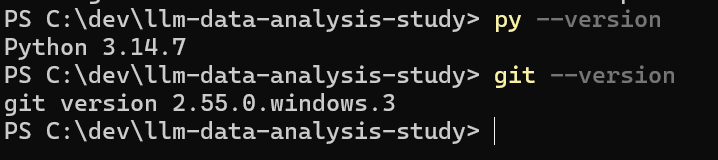
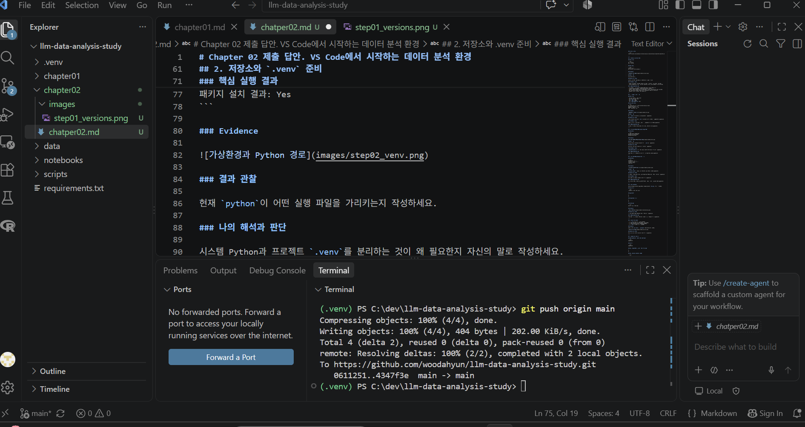
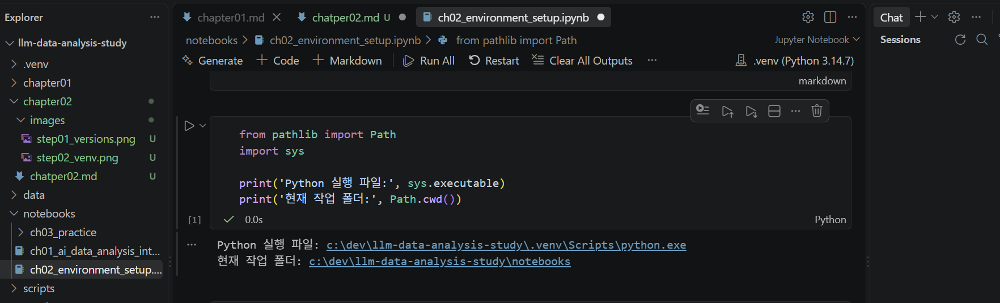
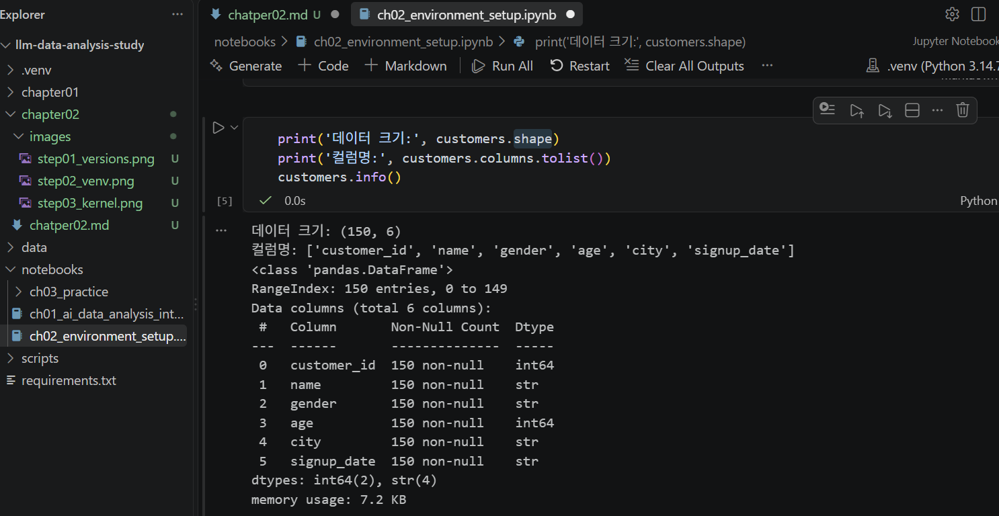

# Chapter 02 제출 답안. VS Code에서 시작하는 데이터 분석 환경
## 0. 제출 정보

- 이름: 우다현
- GitHub ID: woodahyun
- 개인 저장소: `llm-data-analysis-study`
- 작성일: 2026-09-12
- 운영체제: Windows

### 최종 제출 URL

```text
https://github.com/woodahyun/llm-data-analysis-study/blob/main/chapter02/chapter02.md
```

---

## 1. Python과 Git 환경 확인

### 실행 내용

```text
py --version
git --version
```

### 실행 결과

```text
Python 3.14.7
git version 2.55.0.windows.3
```

### Evidence



### 결과 관찰

오류 없이 실행됨.

### 나의 해석과 판단

python, git 모두 최신 버전으로 업데이트 하였으므로 적합함.

### 업무·분석적 의미

- 작성한 코드가 현재 환경에서 정상적으로 실행될 수 있는지 미리 판단할 수 있다. 
- Python 버전에 따라 사용할 수 있는 문법이나 라이브러리의 호환성이 달라질 수 있다.

### 한계와 추가 확인 사항

- VS Code에서 선택된 Python 인터프리터가 확인한 Python 버전과 같은지
- Jupyter Notebook 커널이 올바른 Python 환경을 사용하는지
- pandas, numpy, matplotlib 등 분석에 필요한 라이브러리가 설치되어 있는지와 버전
- 현재 프로젝트 폴더에서 Python 파일과 Notebook이 정상적으로 실행되는지
- 가상환경 venv를 사용하는지와 활성화 상태

---

## 2. 저장소와 `.venv` 준비

### 수행 내용

- [O] 공식 Public 저장소 clone
- [O] 프로젝트 루트 확인
- [O] `.venv` 생성
- [O] `.venv` 활성화
- [O] `requirements.txt` 설치

### 핵심 실행 결과

```text
현재 프로젝트 경로:  c:\dev\llm-data-analysis-study
터미널 Python 실행 파일:  c:\dev\llm-data-analysis-study\.venv\Scripts\python.exe
가상환경 활성화 여부: Ture
패키지 설치 결과: True
```

### Evidence



### 결과 관찰

c:\dev\llm-data-analysis-study\.venv\Scripts\python.exe

### 나의 해석과 판단

- 프로젝트마다 필요한 라이브러리와 버전이 다를 수 있기 때문이다. 
- 시스템 Python에 모든 라이브러리를 설치하면 여러 프로젝트가 서로 영향을 주어 오류가 생길 수 있다. 
- 반면 .venv에는 해당 프로젝트에 필요한 패키지만 설치하므로, 분석 환경을 독립적으로 관리할 수 있다.

### 업무·분석적 의미

다른 사람이 같은 프로젝트를 실행할 때 가상환경을 사용하면 필요한 Python 버전과 라이브러리 구성을 맞출 수 있어 다른 사람이 실행했을 때의 오류를 줄이고 분석 결과의 재현성을 높일 수 있다.

### 한계와 추가 확인 사항

- 회사나 학교 PC는 프로그램 설치, PATH 수정, PowerShell 실행 권한, 가상환경 생성이 제한될 수 있다.
- 같은 Python이라도 버전이 다르면 일부 라이브러리의 설치나 코드 실행 방식이 달라질 수 있다.
- VS Code에서 선택한 Python 인터프리터와 터미널의 python 실행 파일이 서로 다를 수 있으므로 둘 다 확인해야 한다.

---

## 3. VS Code 인터프리터와 Jupyter 커널 연결

### 확인 결과

```text
VS Code Python 인터프리터: Python 3.14.7
Notebook sys.executable: c:\dev\llm-data-analysis-study\.venv\Scripts\python.exe
Notebook Path.cwd(): c:\dev\llm-data-analysis-study\notebooks
```

### Evidence



### 결과 관찰

같음.

### 나의 해석과 판단

- 터미널 Python과 Notebook Python이 같은 .venv를 사용하지 않으면, 터미널에서 설치한 라이브러리를 Notebook에서 찾지 못하거나 반대로 Notebook에서만 실행되는 문제가 생길 수 있다. 
- 만약 터미널에서 pandas를 설치했는데 Notebook이 시스템 Python을 사용하고 있다면, Notebook에서는 ModuleNotFoundError: No module named 'pandas' 오류가 발생할 수 있다. 
- 또한 같은 코드라도 Python 버전이나 라이브러리 버전이 달라 결과가 달라지거나 일부 함수가 실행되지 않을 수 있다.

### 업무·분석적 의미

터미널과 Notebook이 동일한 .venv를 사용하도록 맞추면 라이브러리 설치 위치와 코드 실행 위치가 일치한다. 따라서 ModuleNotFoundError나 버전 충돌 같은 환경 오류를 줄일 수 있다

### 한계와 추가 확인 사항

- 커널 이름은 사용자가 임의로 지정할 수 있고, 서로 다른 가상환경이 같은 이름을 가질 수도 있기 때문에 커널 이름만 보고 판단하면 안 된다.
- Notebook 셀에서 아래 코드를 실행해 실제 Python 실행 파일 경로를 확인해야 한다.
print('Python 실행 파일:', sys.executable)

---

## 4. 샘플 데이터와 Notebook 실행 검증

### 확인 결과

```text
DATA_DIR 존재 여부: True
customers.csv 존재 여부: True
customers.shape: (150,6)
주요 컬럼: ['customer_id', 'name', 'gender', 'age', 'city', 'signup_date']
```

### Evidence



### 결과 관찰

데이터 크기: (150, 6)
컬럼명: ['customer_id', 'name', 'gender', 'age', 'city', 'signup_date']
<class 'pandas.DataFrame'>
RangeIndex: 150 entries, 0 to 149
Data columns (total 6 columns):
 #   Column       Non-Null Count  Dtype
---  ------       --------------  -----
 0   customer_id  150 non-null    int64
 1   name         150 non-null    str  
 2   gender       150 non-null    str  
 3   age          150 non-null    int64
 4   city         150 non-null    str  
 5   signup_date  150 non-null    str  
dtypes: int64(2), str(4)
memory usage: 7.2 KB

	customer_id	name	gender	age	city	signup_date
0	1	김수민	F	19	광주	2024-08-21
1	2	김정호	F	32	대구	2026-01-04
2	3	이경수	F	61	성남	2024-08-14
3	4	조영호	F	55	울산	2026-06-15
4	5	이예원	F	19	부산	2024-11-15


### 나의 해석과 판단

- VS Code, Jupyter Notebook에서 선택한 Python 커널이 정상 실행됨
- 현재 Python 환경에 pandas 라이브러리가 설치되어 있고 정상적으로 import됨
- customers.csv 파일 경로가 올바르며 파일을 읽을 수 있음
- CSV 인코딩과 구분자 형식이 현재 코드와 호환됨
- customers DataFrame이 생성되어 행·열 크기, 컬럼명, 데이터 타입 정보를 확인할 수 있음

### 업무·분석적 의미

분석 전에 최소 스모크 테스트를 하면 본격적인 분석 코드 작성 전에 환경 문제를 빠르게 발견할 수 있다. Python 커널 선택 오류, pandas 미설치, 파일 경로 오류, CSV 읽기 오류 등을 초기에 확인할 수 있다. 

### 한계와 추가 확인 사항

현재 확인한 것은 Python·Notebook·pandas·파일 경로가 연결되어 있는지와 DataFrame 생성 가능 여부이다. 이는 환경 연결 확인 단계이며, 데이터 품질을 검증한 것은 아니다.

추가로
- 결측값, 중복값, 이상값 존재 여부
- customer_id가 중복 없는 고객 식별자인지
- age에 음수나 비현실적인 값이 없는지
- gender, city의 범주값 표기가 일관적인지
- signup_date가 날짜형으로 변환 가능한지
- 다른 파일과 연결할 때 customer_id가 정상적으로 매칭되는지
다음 내용에 대한 확인이 필요하다.

---

## 5. 오류 해결 기록

해당 없음
---

## 6. Secret 보호 확인

- [O] `.env`는 Git 추적 대상이 아닙니다.
- [O] 실제 API Key를 코드에 작성하지 않았습니다.
- [O] 캡처 화면에 Token/비밀번호가 없습니다.
- [O] `.venv`를 Git에 올리지 않습니다.


### 나의 해석과 판단

환경 파일과 비밀정보를 분리해야 하는 이유는,
데이터베이스 비밀번호, API 키, 개인 식별정보, 회사 내부 경로 등을 코드에 직접 작성한 채 GitHub에 올리면 정보가 외부에 노출될 수 있기 때문이다.

비밀번호 등 노출되면 안되는 정보는 .env 파일에 저장하고, .gitignore에 등록하여 GitHub에 업로드되지 않도록 관리해야 한다.

---

## 7. Chapter 02 최종 회고

### 가장 중요했다고 생각한 환경 설정 1가지

```text
프로젝트별 가상환경인 .venv를 만들고, VS Code 터미널과 Notebook 커널이 모두 같은 .venv의 Python을 사용하도록 설정하는 것이다.
```

### 그 이유

```text
분석에 필요한 라이브러리는 특정 Python 환경에 설치되는데, 터미널과 Notebook이 다른 Python을 사용하면 한쪽에서 설치한 라이브러리를 다른 쪽에서 찾지 못해 ModuleNotFoundError가 발생할 수 있다. 
같은 .venv를 사용하면 프로젝트별 패키지와 버전을 독립적으로 관리할 수 있고, 재현성 또한 높일 수 있다.
```

### 다음 Chapter에서 재사용할 환경 체크 3가지

1. 터미널에서 python -c "import sys; print(sys.executable)"를 실행하여 프로젝트 .venv의 Python이 선택되었는지 확인한다.
2. Notebook에서 import sys; print(sys.executable)를 실행하여 터미널과 같은 .venv를 사용하는지 확인한다.
3. pandas를 import하고 CSV 파일을 불러온 뒤 shape, columns, info()를 실행하여 라이브러리·커널·파일 경로가 정상 연결되었는지 확인한다.

### 현재 환경의 한계 또는 주의점

```text
- 현재는 Python, Notebook, pandas, CSV 파일 경로가 연결되었는지만 확인한 상태이며 결측값·중복값·이상값·날짜 형식 등 데이터 품질은 아직 검증하지 않았다. 
- 또한 Python 및 라이브러리 버전, VS Code 인터프리터, Notebook 커널이 이후에도 같은 .venv를 유지하는지 확인해야 한다.
- .venv와 .env 같은 환경·비밀정보 파일은 GitHub에 올리지 않도록 .gitignore로 관리해야 한다.
```

---

## 최종 제출 체크

- [O] 핵심 Evidence 4~7장을 첨부했습니다.
- [O] 단순 캡처가 아니라 관찰과 판단을 작성했습니다.
- [O] Secret/개인정보가 없습니다.
- [O] GitHub에서 이미지가 정상 표시됩니다.
- [O] 개인 저장소에 `chapter02/chapter02.md`를 업로드했습니다.
- [O] 저장소 URL이 아니라 최종 파일 URL을 제출합니다.